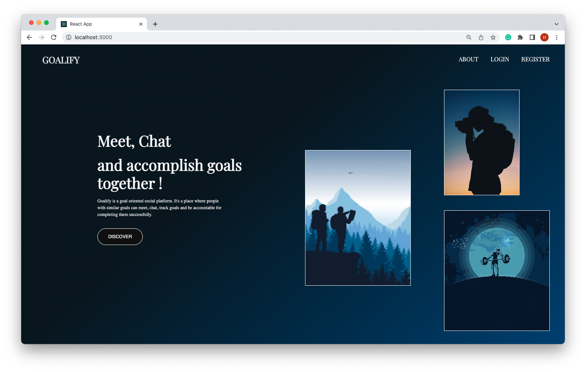
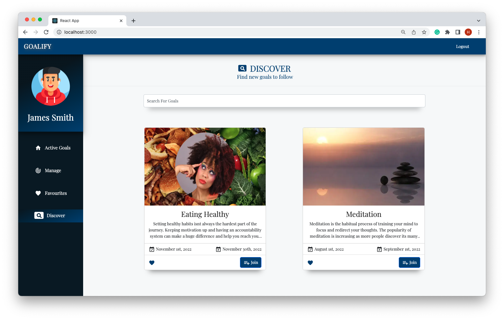
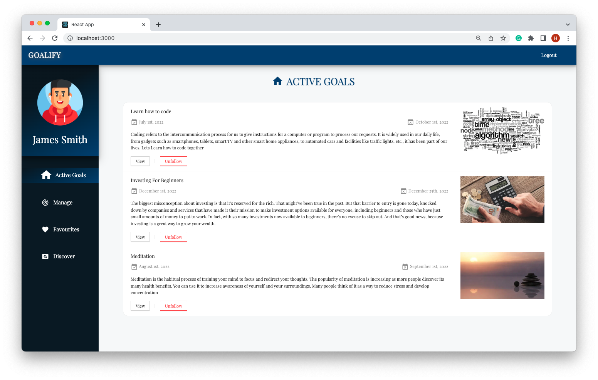
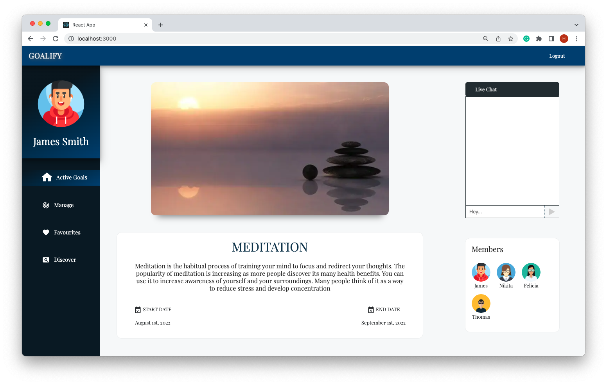
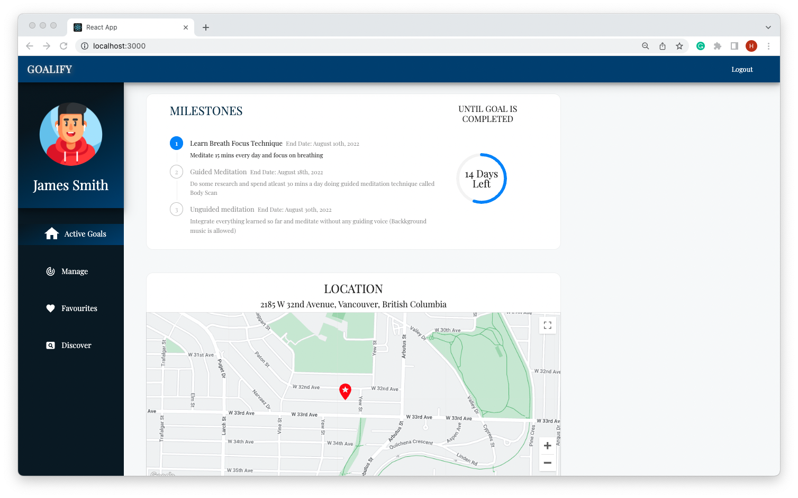
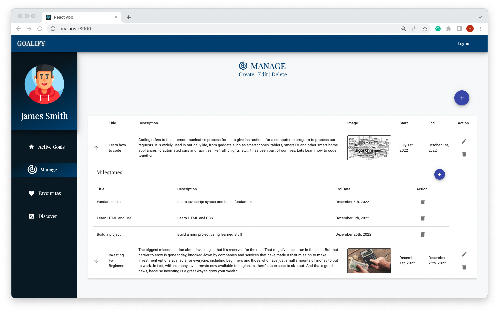

# GOALIFY

Goalify is a goal-oriented social platform. It's a place where people with similar goals can meet, chat, track goals and be accountable for completing them successfully.

## Tech stack
* Frontend: React, Recoil JS, MUI, Bootstrap and ANT Design
* Backend: Node, Express and PostgreSQL
* API: Google Maps API, Socket IO

## Running the projects

You need **TWO** terminal windows/tabs for this (or some other plan for running two Node processes).

In one terminal, `cd` into `react-front-end`. Run `npm install` or `yarn` to install the dependencies. Then run `npm start` or `yarn start`, and go to `localhost:3000` in your browser.

In the other terminal, `cd` into `express-back-end`. Run `npm install` or `yarn` to install the dependencies

### Creating The DB

Use the `psql -U development` command to login to the PostgreSQL server with the username `development` and the password `development`. 

Create a database with the command `CREATE DATABASE goalify_development;`.

Copy the `.env.example` file to `.env.development` and fill in the necessary PostgreSQL configuration. The `node-postgres` library uses these environment variables by default.

```
PGHOST=localhost
PGUSER=development
PGDATABASE=goalify_development
PGPASSWORD=development
PGPORT=5432
```

### Seeding and Running the server

Run the command `npm run db:reset` and then `npm start` or `yarn start` to launch the server.

 

## Features
* Search a goal using the search bar or create your own
* User can add goals to their favourites
* User's with same goal can chat with each other
* User can track completed milestones and progress of a goal
* View the location of goal on google maps (if location provided by the goal creator) 

## Screenshots
* Landing Page

* Dashboard

* Active Goals

* Goal Details

* Progress Bar and MAP

* Manage Goals



## Team

Project completed by [Edgar Sargsyan](https://github.com/Edgarsar), [Huwaida Khalid](https://github.com/Huwaida1990) and [Harshbir Singh](https://github.com/SinghH01)!
